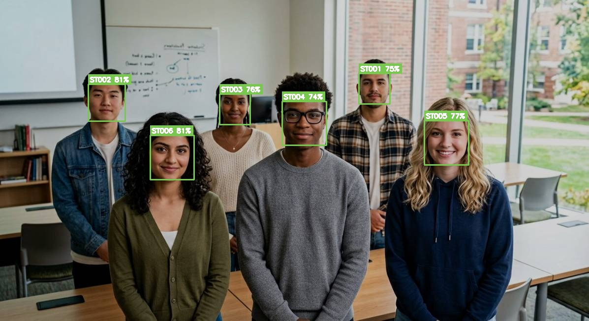
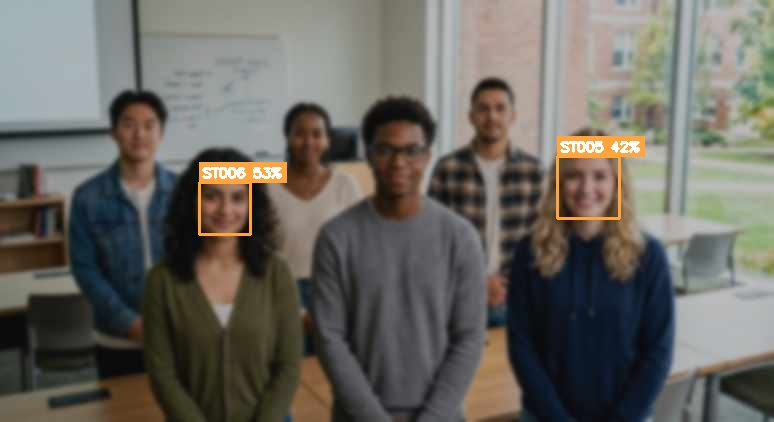
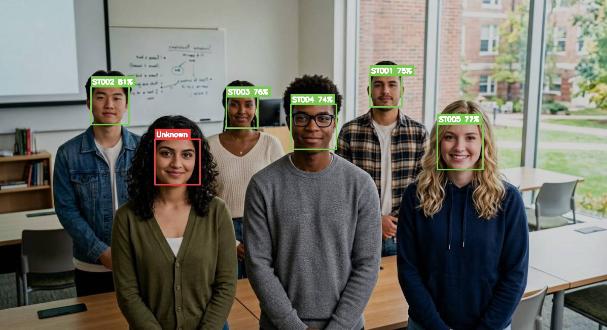

# 🎓 Automated Student Attendance System

AI-suggested, teacher-verified attendance from classroom photos (Human-in-the-Loop).

**Status:** ✅ Phase 1 (environment) · ✅ Phase 2 (face engine) · ✅ Phase 3 (Flask web app) · ✅ Phase 4 (exports, alerts, Docker) · ✅ Phase 5 (email digests, multi-teacher + admin, security hardening) · ✅ Phase 6 (student self-service portal, project report).
**Next:** real SMTP credentials, public HTTPS deployment, optional InsightFace accuracy upgrade.

---

## Results from the built-in demo (`scripts/run_phase2_demo.py`)

| Check | Result |
|---|---|
| Faces detected in 6-student group photo | 6/6 |
| Re-identified on augmented copy (flipped, dimmed, 0.85×, JPEG-70) | 6/6, all `auto_approved`, distance 0.19–0.26 |
| Leave-one-out (enrollment missing ST006) | ST006 correctly `Unknown` (0.726) — no false match |
| Stranger portrait | `Unknown` (0.802) — never auto-approved |
| Harsh photo (0.55×, blur, dim, JPEG-45) | 2 faces found, both `needs_review` (0.470 / 0.583) — HITL band works |
| Functional test suite (`tests/test_face_engine.py`) | 11/11 PASS |

### Good capture → all green, auto-approved


### Degraded capture (small, blurred, dim) → amber `needs_review` band triggers


### Leave-one-out control → un-enrolled student correctly rejected as `Unknown`


Machine-readable report: `data/outputs/phase2_report.json` ·
stress-test: `python scripts/stress_test.py`

---

## How it works

```
enrollment                    recognition (per classroom photo)
──────────                    ─────────────────────────────────
student_faces/ST001.jpg  ──►  detect faces → 128-d encodings
        │                             │
        ▼                             ▼
128-d encoding ──► data/face_encodings.pkl ──► compare to enrolled encodings
                                                │
        ┌───────────────────────────────────────┤ distance d (lower = better)
        ▼                     ▼                 ▼
  d ≤ 0.45              0.45 < d ≤ 0.60     nobody ≤ 0.60
  auto_approved         needs_review        unknown
  (pre-checked ✅)      (teacher confirms)  (teacher assigns name)
```

Thresholds live in `config.py`. Blueprint fix: the original *“confidence ≥ 85%”
(i.e. distance ≤ 0.15)”* rule would put virtually every real match into manual
review — dlib distances for the **same** person typically land at 0.20–0.45.
We auto-approve at d ≤ 0.45 and route 0.45–0.60 to the teacher.

## Quick start

```bash
bash scripts/setup_env.sh            # one-time per session (see notes below)
python scripts/enroll_students.py --rebuild          # enroll everyone in data/student_faces/
python scripts/enroll_students.py --add photo.jpg ST042   # enroll/update one student
python scripts/run_phase2_demo.py                    # end-to-end demo + annotated outputs
python tests/test_face_engine.py                     # functional tests
```

Enrollment rules: one portrait per student, named `<STUDENT_ID>.jpg`, clear and
front-facing. Re-enrolling an ID replaces its encoding. Group photos work for
recognition but always enroll from single-person portraits.

## Project layout

```
config.py                  thresholds & paths (single source of truth)
face_engine/
  detector.py              detection + face cropping
  encoder.py               FaceEncodingStore (enrollment DB, pickle)
  recognizer.py            FaceRecognizer (3-state HITL policy + annotation)
scripts/
  setup_env.sh             environment restore (see "Workspace notes")
  enroll_students.py       enrollment CLI (--rebuild / --add / --list)
  run_phase2_demo.py       end-to-end Phase 2 demo
  stress_test.py           degraded-photo stress test (needs_review band)
tests/test_face_engine.py  functional tests
data/
  student_faces/           enrolled portraits (ST001..ST006 from demo)
  uploads/                 classroom photos (demo + augmented + harsh variants)
  outputs/                 annotated images + phase2_report.json
  face_encodings.pkl       6 enrolled encodings
wheels/                    stashed dlib wheel → instant reinstall
```

## Workspace notes (why `scripts/setup_env.sh` exists)

Installed pip packages do not persist between workspace sessions. The first
setup hit three traps, all solved and automated in `setup_env.sh`:

1. **dlib has no cp313 source-friendly build here** (2-CPU box OOMs compiling
   it) → we use the prebuilt **`dlib-bin`** wheel, stashed in `wheels/` so
   reinstall takes seconds.
2. **`pip install face_recognition` re-pulls dlib from source** → install with
   `--no-deps` on top of dlib-bin (+ `face_recognition_models`, `click`).
3. **`face_recognition_models` needs `pkg_resources`**, removed in
   setuptools ≥ 81 → pin `setuptools<81`.

## Exports, alerts & deployment (Phase 4)

- **CSV exports** (buttons on Analytics): `attendance_raw.csv` (every mark with
  method + AI confidence) and `students_summary.csv` (per-student %, 7-day
  trend, worst subject, at-risk flag).
- **Alerts dashboard** (`/alerts`): at-risk (< 75%) and borderline (< 85%)
  tables with last-7-day trend arrows (▲ improving / ▼ declining) and each
  student's worst subject — the daily to-do list for the teacher.
- **Docker** (also works with `docker compose up`):
  ```bash
  docker build -t autoattendance .
  docker run -p 8000:8000 -v $(pwd)/data:/app/data autoattendance
  ```
  First boot auto-seeds demo data and rebuilds the encoding DB; mount `data/`
  to persist it. Production: serve behind a reverse proxy with HTTPS.

## Email digests, roles & security (Phase 5)

- **Email digest**: at-risk + borderline summary emailed to teachers.
  - Alert page: **Preview email** (see the exact email) and **Send digest now**.
  - `python scripts/send_alerts.py --preview` · run without flags from cron:
    `0 8 * * * cd /path/to/attendance-system && python scripts/send_alerts.py`
  - Demo default is the **console backend** (renders the email to
    `data/outputs/emails/` — no credentials needed). For real delivery:
    `EMAIL_BACKEND=smtp SMTP_HOST=... SMTP_USER=... SMTP_PASSWORD=... ALERT_RECIPIENTS=...`
- **Roles**: admins manage everything via `/admin` (create teacher/admin
  accounts, add subjects, reassign teachers). Teachers see and mark only their
  own subjects and sessions. Demo logins:
  `teacher@college.edu` (admin) · `arjun@college.edu` (teacher, CS405 only) — password `teacher123`.
- **Security hardening**: CSRF tokens on every POST, security headers
  (CSP, nosniff, DENY frames, referrer policy), per-IP login rate limiting
  (5 failures/min), SameSite=Lax + HttpOnly session cookies, ownership checks
  on attendance sessions.

## Student self-service portal (Phase 6)

Public read-only page at **`/me`**: students enter their roll number + PIN
(hashed in the DB; demo PIN `1234`) to see their attendance %, subject-wise
breakdown, recent history and an at-risk warning — no staff login involved.
Failed attempts share the login rate limit, and errors never reveal whether a
roll number exists.

**Formal write-up:** the submission-ready project report (architecture,
methodology, measured accuracy numbers, security, testing) lives in
[`docs/PROJECT_REPORT.md`](docs/PROJECT_REPORT.md).

## Phase 7 ideas (next)

- Admin UI for portal-PIN resets; liveness detection; real SMTP creds on a server
- Public HTTPS deployment (reverse proxy + domain) using the Dockerfile
- Optional accuracy upgrade: InsightFace/YOLOv8 engine behind the same interface
- Student self-service login (OAuth or roll-number + OTP)
